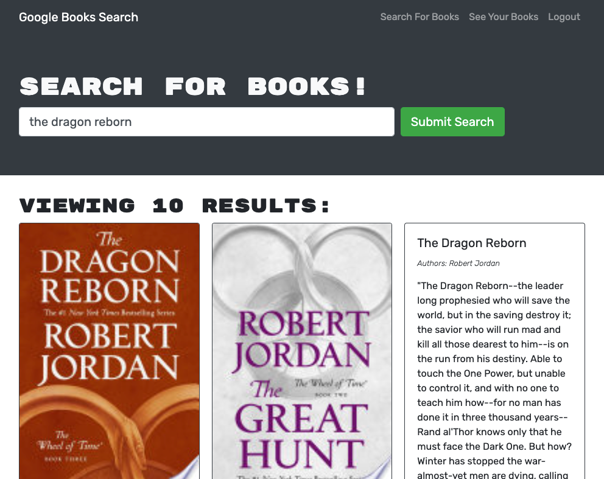

# book-search-engine

This application allows the user to search for books by title using the Google Books API search engine and add books to their personal list of saved books. The application was refactored from its original build using a RESTful API to a GraphQL API built with Apollo Server.

The application is deployed here: https://gentle-refuge-37932.herokuapp.com/

The following tools & packages were used for development:

- Front-End
  - React
  - Apollo Server
  - Bootstrap
  - GraphQL
- Back-End
  - Apollo Server
  - bcrypt
  - Express
  - GraphQL
  - jsonwebtoken
  - Mongoose

## Application Functionality

The application is able to perform the following functions:

- Create user accounts
- Allow existing users to log into the application
- Search for books by title
- Add books to a user's personal list of saved books
- Remove books from a user's personal list of saved books

## Screenshot

Here is a screenshot of the deployed application!

## References

- apollo-server-express: https://www.npmjs.com/package/apollo-server-express
- Apollo: https://www.apollographql.com/docs/
- bcrypt: https://www.npmjs.com/package/bcrypt
- Bootstrap: https://getbootstrap.com/
- Express: https://expressjs.com/
- GraphQL: https://graphql.org/
- jsonwebtoken: https://www.npmjs.com/package/jsonwebtoken
- mongoose: https://mongoosejs.com/
